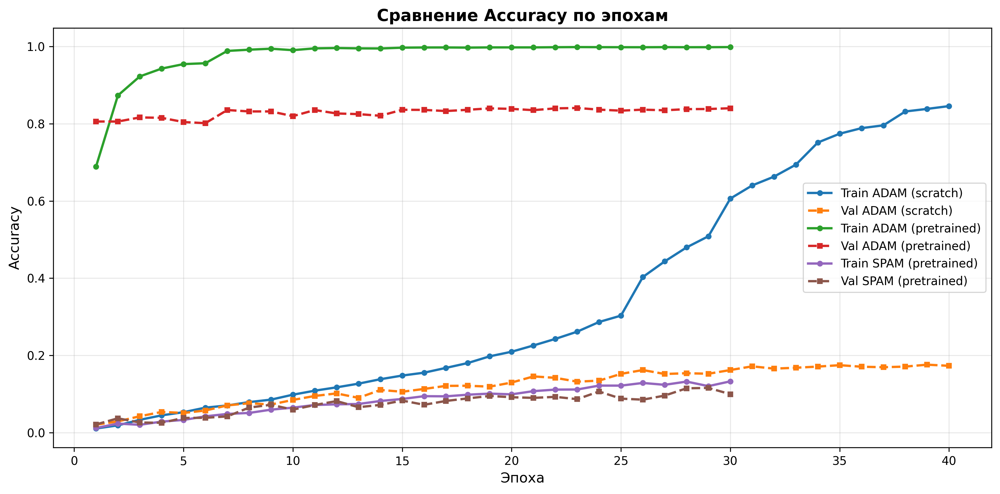
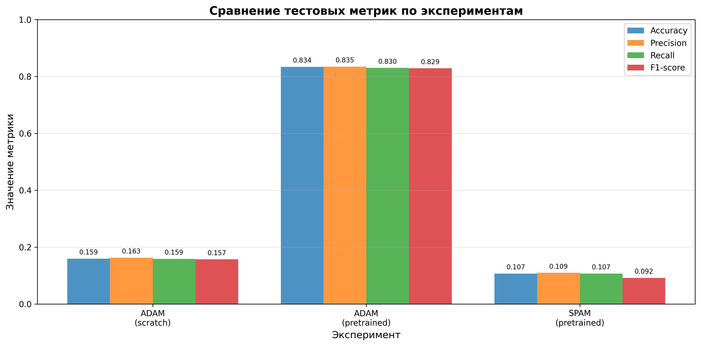

# ОТЧЕТ ПО РАБОТЕ

## Классификация пород собак с использованием Vision Transformer на Stanford Dogs Dataset

---

## 1. Постановка задачи, Цель работы

### 1.1. Постановка задачи

Задача заключается в разработке и исследовании системы классификации пород собак на основе изображений из Stanford Dogs Dataset. Датасет содержит 20,580 изображений 120 различных пород собак, что представляет собой задачу многоклассовой классификации с большим количеством классов.

### 1.2. Цель работы

Основной целью работы является:

1. Разработка системы классификации пород собак с использованием архитектуры Vision Transformer (ViT)
2. Сравнение эффективности различных подходов к обучению:
   - Дообучение предобученной модели (transfer learning)
   - Обучение модели с нуля (training from scratch)
3. Исследование влияния различных оптимизаторов (Adam, SPAM) на качество классификации
4. Оценка производительности модели по метрикам Accuracy, Precision, Recall и F1-score
5. Выбор оптимальной конфигурации модели для развёртывания

---

## 2. Теоретическая база (алгоритмы работы моделей)

### 2.1. Vision Transformer (ViT)

Vision Transformer — это архитектура глубокого обучения, которая применяет механизм внимания (attention) из области обработки естественного языка к задачам компьютерного зрения.

#### Архитектура ViT-B/16:

1. **Разбиение изображения на патчи**: 
   - Входное изображение размером 224×224 пикселей разбивается на непересекающиеся патчи размером 16×16 пикселей
   - Получается 196 патчей (14×14)

2. **Линейная проекция патчей**: 
   - Каждый патч преобразуется в вектор фиксированной размерности 768 (embedding) через линейный слой

3. **Добавление позиционных энкодингов**: 
   - К каждому патчу добавляется информация о его позиции в исходном изображении
   - Добавляется специальный токен [CLS] для классификации

4. **Transformer Encoder**: 
   - Последовательность патчей обрабатывается стандартным Transformer-энкодером
   - Конфигурация: 12 слоев, 12 голов внимания, скрытый размер 768, промежуточный размер 3072
   - Каждый слой состоит из:
     - Multi-Head Self-Attention механизмов
     - Feed-Forward Networks
     - Layer Normalization
     - Residual connections

5. **Классификационная голова**: 
   - Токен [CLS] из последнего слоя проходит через линейный классификатор
   - Выход: логиты для 120 классов пород собак

#### Преимущества ViT:

- **Глобальное внимание**: Модель может учитывать связи между любыми частями изображения
- **Масштабируемость**: Производительность улучшается с увеличением размера модели и объема данных
- **Переносимость**: Предобученные модели можно эффективно дообучать на новых задачах

### 2.2. Оптимизаторы

#### Adam (Adaptive Moment Estimation)

- Адаптивный алгоритм оптимизации, который вычисляет индивидуальные скорости обучения для каждого параметра
- Использует скользящие средние градиентов (momentum) и их квадратов
- Параметры: learning rate = 1e-4, weight decay = 1e-4
- Используется ReduceLROnPlateau scheduler с фактором 0.5 и patience 3

#### SPAM (Spike-Aware Adam with Momentum Reset)

- Модификация Adam с периодическим сбросом момента (momentum reset)
- Включает механизм обнаружения "спайков" в градиентах
- Применяет адаптивное обрезание градиентов относительно экспоненциально взвешенного среднего квадратов градиентов
- Параметры: learning rate = 1e-3, warmup_steps = 150, threshold = 5000, DeltaT = 500
- Имеет встроенный warmup механизм

### 2.3. Предобработка данных

#### Для обучения:
- Resize до 224×224
- RandomHorizontalFlip (вероятность 0.5)
- RandomRotation (до 10 градусов)
- ColorJitter (brightness=0.2, contrast=0.2)
- Нормализация по ImageNet (mean=[0.485, 0.456, 0.406], std=[0.229, 0.224, 0.225])

#### Для валидации и тестирования:
- Resize до 224×224
- Нормализация по ImageNet

### 2.4. Метрики оценки

- **Accuracy**: Доля правильно классифицированных изображений
- **Precision** (macro): Средняя точность по всем классам
- **Recall** (macro): Средняя полнота по всем классам
- **F1-score** (macro): Гармоническое среднее Precision и Recall

### 2.5. Функция потерь и регуляризация

- **CrossEntropyLoss**: стандартная функция потерь для многоклассовой классификации; включает `log-softmax` и `nll_loss`, поэтому принимает необработанные логиты модели и автоматически нормализует их внутри вычисления.
- **Без весов классов**: классы не балансировались вручную; распределение пород в Stanford Dogs относительно ровное, поэтому класс-весы не задавались.
- **Без label smoothing**: использовалась жесткая целевая метка, чтобы не размывать редкие классы и сохранить точные вероятности.
- **Weight decay**: 1e-4 для Adam как L2-регуляризация параметров; для SPAM weight decay не применялся, т.к. оптимизатор опирается на собственный механизм сглаживания спайков.
- **Градиентная стабильность**: AMP с автокастом снижает численные ошибки; для SPAM дополнительно есть пороговое отслеживание "спайков" (threshold=5000) и сброс момента (`DeltaT=500`), что выступает как адаптивная защита от взрывных градиентов.

---

## 3. Результаты работы и тестирования системы

### 3.1. Конфигурации экспериментов

Было проведено три эксперимента:

| Эксперимент | Предобучение | Оптимизатор | Learning Rate | Эпохи | Batch Size |
|-------------|---------------|-------------|---------------|-------|------------|
| 1 | Да | Adam | 1e-4 | 30 | 32 |
| 2 | Нет | Adam | 1e-4 | 40 | 32 |
| 3 | Да | SPAM | 1e-3 | 30 | 32 |

Все эксперименты использовали:
- Mixed Precision Training (AMP) для ускорения на GPU
- CrossEntropyLoss как функцию потерь
- Разделение данных: train/val/test

### 3.2. Результаты на тестовой выборке

#### Таблица результатов:

| Конфигурация | Accuracy | Precision | Recall | F1-score | Best Val Acc |
|--------------|----------|-----------|--------|----------|--------------|
| ViT + Adam, **предобученная** | **0.8341** | **0.8347** | **0.8302** | **0.8287** | **0.8407** |
| ViT + Adam, обучение с нуля | 0.1594 | 0.1625 | 0.1586 | 0.1569 | 0.1762 |
| ViT + SPAM, предобученная | 0.1069 | 0.1092 | 0.1069 | 0.0915 | 0.1160 |

### 3.3. Анализ результатов обучения

#### Эксперимент 1: ViT + Adam, предобученная модель

- **Начальная точность** (эпоха 1): Train Acc = 0.6889, Val Acc = 0.8056
- **Финальная точность** (эпоха 30): Train Acc = 0.9983, Val Acc = 0.8400
- **Тестовая точность**: 0.8341
- **Наблюдения**:
  - Модель быстро достигает высокой точности благодаря предобученным весам
  - После 7-й эпохи train accuracy превышает 0.98, что указывает на хорошую сходимость
  - Val accuracy стабилизируется около 0.84, что говорит о хорошей обобщающей способности
  - Небольшой разрыв между train и val accuracy указывает на отсутствие переобучения

#### Эксперимент 2: ViT + Adam, обучение с нуля

- **Начальная точность** (эпоха 1): Train Acc = 0.0110, Val Acc = 0.0208
- **Финальная точность** (эпоха 40): Train Acc = 0.8456, Val Acc = 0.1732
- **Тестовая точность**: 0.1594
- **Наблюдения**:
  - Модель начинает с очень низкой точности (около 1%)
  - Медленный рост точности: к 30-й эпохе train accuracy достигает 0.6061
  - Большой разрыв между train (0.8456) и val (0.1732) accuracy указывает на переобучение
  - ViT требует большого объема данных для обучения с нуля без предобучения

#### Эксперимент 3: ViT + SPAM, предобученная модель

- **Начальная точность** (эпоха 1): Train Acc = 0.0123, Val Acc = 0.0215
- **Финальная точность** (эпоха 30): Train Acc = 0.1331, Val Acc = 0.0998
- **Тестовая точность**: 0.1069
- **Наблюдения**:
  - Модель не смогла эффективно использовать предобученные веса
  - Очень низкая точность на протяжении всего обучения
  - Learning rate = 1e-3 оказался слишком высоким для данной задачи
  - SPAM требует дополнительной настройки гиперпараметров

### 3.4. Сравнение предобученной модели vs обучение с нуля

| Метрика | Предобученная (среднее) | С нуля | Разница |
|---------|-------------------------|--------|---------|
| Accuracy | 0.4705 | 0.1594 | +0.3111 |
| Precision | 0.4720 | 0.1625 | +0.3094 |
| Recall | 0.4686 | 0.1586 | +0.3100 |
| F1-score | 0.4601 | 0.1569 | +0.3032 |

**Вывод**: Предобучение дает значительное преимущество (+31% по Accuracy), что подтверждает важность transfer learning для задач компьютерного зрения.

### 3.5. Графики обучения

Графики сохранены в папке `plots/`:

1. **`plots/accuracy_curves.png`** — динамика Accuracy на train и validation наборах для всех экспериментов
2. **`plots/loss_curves.png`** — динамика Loss на train и validation наборах
3. **`plots/f1_curves.png`** — динамика F1-score на train и validation наборах
4. **`plots/test_metrics_comparison.png`** — сравнение финальных метрик на тестовой выборке

#### Ключевые наблюдения из графиков:

- **Предобученная модель с Adam**: Быстрая сходимость, стабильное обучение, высокие метрики
- **Обучение с нуля**: Медленная сходимость, признаки переобучения, низкие метрики
- **SPAM**: Нестабильное обучение, низкие метрики, требует тюнинга

### 3.6. Визуализация результатов

*Рисунок 1: Динамика Accuracy на train и validation наборах*

*Рисунок 2: Сравнение финальных метрик на тестовой выборке*

---

## 4. Выводы по работе

### 4.1. Основные выводы

1. **Лучшая модель**: Vision Transformer с предобученными весами и оптимизатором Adam показала наилучшие результаты:
   - Accuracy: **0.8341** (83.41%)
   - F1-score: **0.8287** (82.87%)
   - Precision: **0.8347** (83.47%)
   - Recall: **0.8302** (83.02%)

2. **Критическая важность transfer learning**: 
   - Предобучение дает преимущество в **+31%** по Accuracy
   - Модель с предобученными весами достигает высокой точности уже после первой эпохи (~69% на train)
   - Обучение с нуля даже после 40 эпох достигает лишь ~16% Accuracy на тесте

3. **Влияние оптимизатора**:
   - Adam с learning rate 1e-4 показал отличные результаты для предобученной модели
   - SPAM с learning rate 1e-3 оказался неэффективным и требует дополнительной настройки гиперпараметров
   - Для SPAM необходимо снизить learning rate и настроить параметры warmup/threshold

4. **Особенности обучения**:
   - Предобученная модель быстро сходится и не показывает признаков переобучения
   - Модель, обученная с нуля, демонстрирует переобучение (большой разрыв между train и val accuracy)
   - ViT требует большого объема данных для эффективного обучения с нуля

5. **Практические рекомендации**:
   - Для задач классификации изображений с ограниченным датасетом необходимо использовать предобученные модели
   - Adam является надежным выбором оптимизатора для fine-tuning предобученных моделей
   - Mixed Precision Training (AMP) успешно применяется для ускорения обучения без потери качества

### 4.2. Ограничения и направления для улучшения

1. **SPAM оптимизатор**: Требует дополнительного исследования и настройки гиперпараметров
2. **Обучение с нуля**: Может потребоваться больше данных или более агрессивная регуляризация
3. **Аугментация данных**: Можно расширить набор аугментаций для улучшения обобщения
4. **Ensemble методы**: Комбинация нескольких моделей может улучшить результаты

### 4.3. Рекомендации для развёртывания

Для практического применения рекомендуется использовать:
- **Модель**: Vision Transformer с предобученными весами (`google/vit-base-patch16-224`)
- **Оптимизатор**: Adam с learning rate 1e-4
- **Количество эпох**: 30 (можно остановиться раньше при достижении плато)
- **Mixed Precision**: Включен для ускорения inference на GPU

---

## 5. Использованные источники

1. **Dosovitskiy, A., et al.** "An Image is Worth 16x16 Words: Transformers for Image Recognition at Scale." *arXiv preprint arXiv:2010.11929* (2020).

2. **Hugging Face Transformers Documentation**: 
   - ViTModel: https://huggingface.co/docs/transformers/model_doc/vit
   - ViTConfig: https://huggingface.co/docs/transformers/model_doc/vit#transformers.ViTConfig

3. **PyTorch Documentation**:
   - torchvision.transforms: https://pytorch.org/vision/stable/transforms.html
   - Automatic Mixed Precision (AMP): https://pytorch.org/docs/stable/amp.html
   - Optimizers: https://pytorch.org/docs/stable/optim.html

4. **Stanford Dogs Dataset**: 
   - Khosla, A., et al. "Novel dataset for Fine-Grained Image Categorization." *First Workshop on Fine-Grained Visual Categorization, IEEE Conference on Computer Vision and Pattern Recognition* (2011).
   - Dataset: http://vision.stanford.edu/aditya86/ImageNetDogs/

5. **Kingma, D. P., & Ba, J.** "Adam: A Method for Stochastic Optimization." *arXiv preprint arXiv:1412.6980* (2014).

6. **SPAM Optimizer**: Spike-Aware Adam with Momentum Reset - реализация в проекте `galore_torch`.

